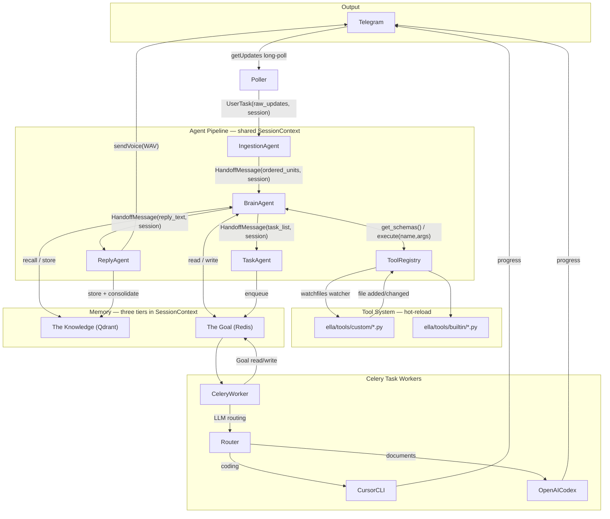

# Ella AI Agent Pipeline — Architecture Plan

> **Created:** 2026-02-23  
> **Last updated:** 2026-02-23  
> **Status:** Planning — pending implementation

---

## Agent Topology (AutoGen Handoff Pattern)

Inspired by Microsoft AutoGen v0.4's handoff design. Each agent receives a `SessionContext` (shared conversation history + memory reference), does its work, then hands off to the next agent. No central orchestrator — agents are self-directing via typed message passing.



---

## Handoff Message Protocol

Modelled on AutoGen's `UserTask` / `AgentResponse` pattern:

```python
# ella/agents/protocol.py
@dataclass
class SessionContext:
    chat_id: int
    focus: list[LLMMessage]        # Tier 1 — The Focus: active step context (in-memory)
    goal: JobGoal | None           # Tier 2 — The Goal: job-scoped shared state (Redis-backed)
    knowledge: KnowledgeStore      # Tier 3 — The Knowledge: reference to Qdrant store

@dataclass
class UserTask:
    raw_updates: list[TelegramUpdate]
    session: SessionContext

@dataclass
class HandoffMessage:
    payload: Any                   # typed per handoff: list[MessageUnit] | ReplyPayload | list[Task]
    session: SessionContext        # forwarded through pipeline; agents write to focus / goal / knowledge
```

Each agent appends its step output to `session.focus` and, when a step completes, writes a `StepSummary` to `session.goal` in Redis. The next agent/step in the same job rehydrates The Focus from The Goal — so context is never lost even across Celery workers or agent boundaries.

---

## Three-Tier Memory Architecture

Inspired by cognitive science (CogMem, 2024) and the access-frequency principle: the tighter the scope, the higher the access frequency, the faster the store.

```mermaid
flowchart LR
    subgraph focus ["The Focus (task-scoped, in-memory)"]
        F1[current step messages]
        F2[tool call results this step]
        F3[immediate scratchpad]
    end

    subgraph goal ["The Goal (job-scoped, Redis)"]
        G1[job objective + constraints]
        G2[steps completed so far]
        G3[inter-agent handoff notes]
        G4[partial results]
    end

    subgraph knowledge ["The Knowledge (permanent, Qdrant)"]
        K1[all past conversations]
        K2[learned task patterns]
        K3[user preferences]
        K4[tool usage history]
    end

    focus -->|"step completes → summarise → write"| goal
    goal -->|"job completes → consolidate → write"| knowledge
    knowledge -->|"job start: top-K recall"| goal
    goal -->|"step start: inject"| focus
```



### Tier 1 — The Focus (task / step scope)

- **What it is:** the active context window for a single agent executing a single step
- **Scope:** one step of one job — discarded after the step completes
- **Storage:** Python in-memory only (`list[LLMMessage]` inside `HandoffMessage.session`)
- **Access frequency:** every LLM token generation — highest frequency
- **Contents:**
  - Current step's input messages
  - Tool call / result pairs this step
  - Agent scratchpad (chain-of-thought, intermediate outputs)
- **Lifecycle:** created when a step starts, appended to during the ReAct loop, summarised into The Goal when the step completes

### Tier 2 — The Goal (job scope)

- **What it is:** shared working memory for all agents and steps contributing to one job
- **Scope:** one job (a job = a multi-step task extracted by BrainAgent) — persists until the job is marked complete or failed
- **Storage:** Redis hash keyed by `job_id` — fast read/write, automatic TTL expiry (default 24h)
- **Access frequency:** once per step start (read) + once per step end (write) — medium frequency
- **Contents:**

```python
@dataclass
class JobGoal:
    job_id: str
    chat_id: int
    objective: str                   # the original task description
    steps_total: int
    steps_done: list[StepSummary]    # compact summary of each completed step
    shared_notes: dict[str, Any]     # any agent can write key facts here
    partial_outputs: list[str]       # intermediate artefacts (file paths, URLs, etc.)
    status: Literal["running", "complete", "failed"]
```

- **Usage pattern:**
  - Start of step: worker reads `JobGoal` → injects objective + prior step summaries into The Focus
  - End of step: worker writes compact `StepSummary` back to The Goal
  - All agents on the same job share the same `job_id` → same Redis hash → always consistent

### Tier 3 — The Knowledge (permanent scope)

- **What it is:** long-term semantic memory across all jobs, users, and sessions
- **Scope:** permanent, per `chat_id` — never discarded (pruning via TTL or explicit delete only)
- **Storage:** Qdrant vector collections — semantic similarity search
- **Access frequency:** once per job start (recall) + once per job end (consolidate) — lowest frequency
- **Collections:**
  - `ella_conversations` — user+assistant exchange embeddings `{chat_id, timestamp, text, role}`
  - `ella_task_patterns` — successful job completion patterns `{task_type, steps, outcome}` — used to seed future similar jobs
  - `ella_user_prefs` — inferred preferences, language, working style `{chat_id, preference_key, value}`
- **Usage pattern:**
  - Job start: BrainAgent queries `ella_conversations` + `ella_task_patterns` → top-K results seed The Goal's `shared_notes`
  - Job end: ReplyAgent consolidates The Goal into `ella_conversations` + updates `ella_task_patterns` if the job was a task

### Memory Flow Per Job

```
1. Telegram batch arrives
   → BrainAgent recalls from Knowledge (top-K) → seeds Goal
   → Goal injected into Focus of first step

2. Each step (possibly different agent, different Celery worker):
   → Read Goal from Redis → inject into Focus
   → Execute step (tool calls, LLM turns — all in Focus)
   → Write StepSummary to Goal in Redis
   → Discard Focus (in-memory, GC'd)

3. Job completes:
   → ReplyAgent consolidates Goal into Knowledge (Qdrant)
   → Goal TTL expires in Redis (or explicit delete)
```

### Why Redis for The Goal (not Qdrant)

The Goal is accessed once per step — potentially every few seconds for a multi-step job. Redis gives sub-millisecond read/write with native hash operations. Qdrant would add unnecessary embedding overhead for structured, keyed data that doesn't need semantic search. The Goal is structured; The Knowledge is semantic.

---

## Tool System — Dynamic Hot-Reload

### Tool Authoring Contract

Any Python file dropped into `ella/tools/custom/` is a valid tool if it contains at least one function decorated with `@ella_tool`. No restart required — the tool is available on the very next message batch.

```python
# ella/tools/custom/my_tool.py  — user-created, no restart needed
from ella.tools.registry import ella_tool

@ella_tool(
    name="fetch_weather",
    description="Get current weather for a city. Returns temperature and conditions.",
)
def fetch_weather(city: str, unit: str = "celsius") -> str:
    """city: city name. unit: celsius or fahrenheit."""
    ...  # implementation
```

- The decorator uses the function signature + docstring to auto-generate a JSON schema compatible with Qwen2.5's function-calling format
- No restart, no re-import of the agent — the tool is available on the very next message batch

### ToolRegistry (`ella/tools/registry.py`)

```python
class ToolRegistry:
    def register(self, fn: Callable) -> None         # called by @ella_tool
    def get_schemas(self) -> list[dict]              # live snapshot for LLM prompt injection
    def execute(self, name: str, args: dict) -> Any  # dispatches to registered function
    def _watch(self) -> None                         # background asyncio task using watchfiles.awatch()
```

Lifecycle:

1. At startup: scan `ella/tools/builtin/` and `ella/tools/custom/` — `importlib.import_module` each `.py` file; `@ella_tool` auto-registers on import
2. `watchfiles.awatch()` runs as an asyncio background task monitoring both directories
3. On file **created or modified**: `importlib.reload(module)` → re-registers all `@ella_tool` functions in that file; old versions replaced atomically
4. On file **deleted**: removes all tools from that module from the registry
5. Thread-safe: registry uses `asyncio.Lock` around read/write to `_tools: dict[str, ToolEntry]`

### BrainAgent Tool-Call Loop

BrainAgent injects `registry.get_schemas()` into the LLM prompt at call time (always fresh). If the LLM returns a tool call instead of a final reply:

```
LLM generates tool_call → registry.execute(name, args) → result appended to session.focus
    → LLM called again with tool result → repeat until LLM returns plain reply
```

Standard ReAct-style loop, capped at `MAX_TOOL_ROUNDS` (env var, default 5).

---

## Project Structure

```
ai.Ella/
├── ella/
│   ├── __init__.py
│   ├── config.py                      # All env-based config (pydantic-settings)
│   ├── telegram/
│   │   ├── poller.py                  # Long-poll loop (getUpdates, timeout=20s)
│   │   ├── sender.py                  # sendMessage / sendVoice helpers
│   │   └── models.py                  # Pydantic models for Telegram payloads
│   ├── agents/
│   │   ├── protocol.py                # SessionContext, UserTask, HandoffMessage dataclasses
│   │   ├── base_agent.py              # BaseAgent ABC: handle(msg) -> HandoffMessage
│   │   ├── ingestion_agent.py         # Media → ordered list[MessageUnit]; hands off to BrainAgent
│   │   ├── brain_agent.py             # Knowledge recall → Goal init → tool-call loop → reply + tasks
│   │   ├── reply_agent.py             # TTS → sendVoice → Knowledge store + Goal consolidate
│   │   └── task_agent.py              # Enqueue tasks → Celery; monitor + Telegram updates
│   ├── ingestion/
│   │   ├── text_handler.py            # Pass-through, strip Telegram formatting
│   │   ├── voice_handler.py           # Download OGG → mlx-whisper STT → text
│   │   ├── video_handler.py           # Download video → frames → Qwen2.5-VL-3B summary
│   │   └── sequencer.py               # Sort by message_id, return list[MessageUnit]
│   ├── tools/
│   │   ├── registry.py                # ToolRegistry: @ella_tool decorator, watchfiles watcher,
│   │   │                              #   get_schemas(), execute(), hot-reload on file change
│   │   ├── builtin/
│   │   │   ├── web_search.py          # @ella_tool: search the web
│   │   │   ├── run_shell.py           # @ella_tool: run a shell command (sandboxed)
│   │   │   ├── read_file.py           # @ella_tool: read a local file
│   │   │   └── write_file.py          # @ella_tool: write/append a local file
│   │   └── custom/                    # ← USER DROPS NEW TOOLS HERE; picked up without restart
│   │       └── .gitkeep
│   ├── tts/
│   │   └── xtts.py                    # XTTS-v2 singleton, tts_to_wav(text, language)
│   ├── memory/
│   │   ├── embedder.py                # sentence-transformers paraphrase-multilingual-MiniLM-L12-v2
│   │   ├── focus.py                   # Tier 1 — The Focus: in-memory LLMMessage helpers
│   │   ├── goal.py                    # Tier 2 — The Goal: JobGoal dataclass + GoalStore (Redis)
│   │   └── knowledge.py               # Tier 3 — The Knowledge: KnowledgeStore (Qdrant)
│   ├── tasks/
│   │   ├── celery_app.py              # Celery app init, Redis broker/backend
│   │   └── worker.py                  # Celery task: Goal read → LLM route → execute → Goal write
│   └── main.py                        # Startup: XTTS, Qdrant, ToolRegistry watcher, Celery, poller
├── scripts/
│   └── init_qdrant.py                 # Create Qdrant collections on first run
├── plan/
│   └── 2026-02-23-ella-agent-pipeline.md  # This file
├── docker-compose.yml                 # Redis + Qdrant
├── requirements.txt
├── .env.example
└── Documentation/
    └── architecture.md
```

---

## Key Implementation Details

### 1. Telegram Poller (`ella/telegram/poller.py`)

- Use `getUpdates` with `timeout=20` (long-polling — Telegram holds the connection up to 20s; no hard rate limit on `getUpdates`)
- Track `offset = last_update_id + 1` to avoid reprocessing
- On each batch: load or retrieve `SessionContext` for the `chat_id`, wrap in `UserTask`, invoke `IngestionAgent.handle()`
- Exponential backoff on network errors, respecting `Retry-After` headers

### 2. Agent: `IngestionAgent` (`ella/agents/ingestion_agent.py`)

- Receives `UserTask(raw_updates, session)`
- Dispatches each update to the appropriate handler (sequential to stay within RAM):
  - **Text**: pass-through, strip Telegram markdown
  - **Voice** (on-demand): load `mlx-whisper` (whisper-small, ~0.5 GB) → transcribe (`language=None` for auto-detect zh/en) → unload
  - **Video** (on-demand): load `Qwen2.5-VL-3B-Instruct-4bit` (~4-5 GB) → extract frames with `opencv-python` → summarise → unload
- Sorts all results by `message_id` to restore original order
- Appends raw user content to `session.focus` as `UserMessage`
- Returns `HandoffMessage(payload=list[MessageUnit], session=session)` → handed to `BrainAgent`

### 3. Agent: `BrainAgent` (`ella/agents/brain_agent.py`)

- Receives `HandoffMessage` from `IngestionAgent`
- **Knowledge recall** (Tier 3, low freq): `session.knowledge.recall(query, chat_id, top_k=5)` → top-K past exchanges + task patterns → prepended to `session.focus`
- **Goal initialisation** (Tier 2, medium freq): creates `JobGoal` in Redis keyed by `job_id`; seeds it with the objective and recalled knowledge snippets; attaches to `session.goal`
- **Live tool injection**: calls `tool_registry.get_schemas()` at call time — always includes any hot-loaded tools
- **On-demand LLM**: load `Qwen2.5-7B-Instruct-4bit` (~4.3 GB) → run tool-call loop → `del model; mx.metal.clear_cache()`
- **Tool-call loop** (ReAct style, all within The Focus):
  1. LLM generates response → if tool call: `registry.execute(name, args)` → append result to `session.focus` → call LLM again
  2. Repeat until plain text reply or `MAX_TOOL_ROUNDS` reached
  3. Extract final reply + `tasks[]`
- Prompt structure: system persona + Knowledge snippets + Goal objective + Focus messages + tool schemas
- LLM final output: `{"reply": "...", "language": "en|zh", "tasks": [{"type": "...", "description": "...", "priority": 1}]}`
- Appends `AssistantMessage(reply)` to `session.focus`
- Hands off two messages:
  - `HandoffMessage(payload=ReplyPayload(text, language), session)` → `ReplyAgent`
  - `HandoffMessage(payload=list[Task], session)` → `TaskAgent`

### 4. Agent: `ReplyAgent` (`ella/agents/reply_agent.py`)

- **XTTS-v2 is the only permanently resident model** (~4.6 GB, loaded at startup)
- XTTS-v2 supports Chinese (zh-cn) and English natively
- Calls `xtts.tts_to_wav(text, language)` → temp WAV file
- Sends WAV via `telegram.sendVoice(chat_id, wav_path)`
- **Knowledge store** (Tier 3): consolidates exchange into `session.knowledge.store()` in Qdrant
- If the job had tasks: calls `session.knowledge.consolidate(goal)` to write task patterns

### 5. Agent: `TaskAgent` (`ella/agents/task_agent.py`)

- Receives extracted task list from `BrainAgent`
- Each task enqueued with `{task_id, job_id, type, description, chat_id}` — `job_id` links to The Goal in Redis
- Monitors task state via Celery result backend; sends Telegram `sendMessage` progress updates (PENDING → STARTED → SUCCESS/FAILURE)

### 6. Celery Task Worker (`ella/tasks/worker.py`)

- Each Celery task carries: `{task_id, job_id, task_type, description, chat_id}`
- **Goal read** (Tier 2): loads `JobGoal` from Redis by `job_id` → reconstructs Focus context from prior step summaries
- Loads `Qwen2.5-7B-Instruct-4bit` on-demand for routing: `{"route": "cursor" | "codex" | "other"}`
- Dispatches to: Cursor headless CLI (`subprocess`) or OpenAI Codex (`openai` SDK)
- **Goal write** (Tier 2): writes `StepSummary` back to Redis `JobGoal` on completion
- Sends progress `sendMessage` updates to `chat_id`

### 7. Memory (`ella/memory/`)

- **`focus.py`** — thin helpers over `list[LLMMessage]`; `build_focus_prompt(focus, goal, knowledge_snippets)` assembles the full LLM input
- **`goal.py`** — `JobGoal` dataclass; `GoalStore` wraps Redis: `create(job_id)`, `read(job_id)`, `append_step(job_id, summary)`, `complete(job_id)`, TTL=24h
- **`knowledge.py`** — `KnowledgeStore` wraps Qdrant:
  - `recall(query, chat_id, top_k)` — semantic search across `ella_conversations` + `ella_task_patterns`
  - `store(exchange)` — upsert user+assistant turn
  - `consolidate(goal)` — on job completion, writes task pattern to `ella_task_patterns`
- **Qdrant collections:**
  - `ella_conversations` — `{chat_id, timestamp, role, text}`, dim=384
  - `ella_task_patterns` — `{task_type, steps_summary, outcome}`, dim=384
  - `ella_user_prefs` — `{chat_id, preference_key, value}`, dim=384
- Embedder: `paraphrase-multilingual-MiniLM-L12-v2` (dim=384), in-process, Chinese+English

---

## Memory Budget (M4 16GB Unified RAM)

Models are **never all loaded simultaneously**. Each model is loaded, used, then explicitly unloaded with `del model; mx.metal.clear_cache()` before the next stage.

| Stage | Peak RAM | Notes |
|---|---|---|
| STT (whisper-small) | ~8.6 GB | XTTS resident + OS |
| Video (Qwen2.5-VL-3B-4bit) | ~12.1 GB | Comfortable; upgrade to VL-7B via env var |
| Chat LLM (Qwen2.5-7B-4bit) | ~12.4 GB | Comfortable |
| TTS only (XTTS-v2) | ~8.1 GB | Lightest stage |

XTTS-v2 (~4.6 GB) is the only permanently resident model.

---

## Model Selection

| Component | Model | Rationale |
|---|---|---|
| Chat LLM | `mlx-community/Qwen2.5-7B-Instruct-4bit` | First-class Chinese+English (18T tokens, 29 languages); ~4.3 GB |
| Vision/Video | `mlx-community/Qwen2.5-VL-3B-Instruct-4bit` | Bilingual VL, fits 16GB comfortably; env var to upgrade to 7B |
| STT | `mlx-community/whisper-small` | Multilingual, auto-detects zh/en; ~0.5 GB; upgrade to large-v3-turbo via env var |
| TTS | XTTS-v2 (coqui/TTS) | Official zh-cn + en support; in-process via `TTS` Python library |
| Embeddings | `paraphrase-multilingual-MiniLM-L12-v2` | 50+ languages incl. zh+en; dim=384; in-process |

---

## Infrastructure

- `redis:7-alpine` — Celery broker + result backend + The Goal store (Docker)
- `qdrant/qdrant` — The Knowledge vector store (Docker)
- All LLM/STT/TTS/embedding inference: in-process via MLX, no server processes

---

## Environment Variables

| Variable | Default | Notes |
|---|---|---|
| `TELEGRAM_BOT_TOKEN` | — | Required |
| `MLX_CHAT_MODEL` | `mlx-community/Qwen2.5-7B-Instruct-4bit` | Chat + task routing LLM |
| `MLX_VL_MODEL` | `mlx-community/Qwen2.5-VL-3B-Instruct-4bit` | Video summarisation; upgrade to 7B if RAM permits |
| `MLX_WHISPER_MODEL` | `mlx-community/whisper-small` | STT; use `whisper-large-v3-turbo` for better accuracy |
| `EMBED_MODEL` | `paraphrase-multilingual-MiniLM-L12-v2` | Qdrant embedding model |
| `SPEAKER_WAV_PATH` | — | Reference voice WAV for XTTS-v2 cloning |
| `REDIS_URL` | `redis://localhost:6379/0` | Celery broker + The Goal store |
| `QDRANT_URL` | `http://localhost:6333` | The Knowledge vector store |
| `OPENAI_API_KEY` | — | For Codex task routing |
| `TOOLS_CUSTOM_DIR` | `ella/tools/custom/` | Watched for hot-loaded user tools |
| `MAX_TOOL_ROUNDS` | `5` | Max ReAct tool-call iterations per message batch |
| `GOAL_TTL_SECONDS` | `86400` | Redis TTL for JobGoal (24h) |
| `KNOWLEDGE_RECALL_TOP_K` | `5` | Qdrant results injected per job start |
