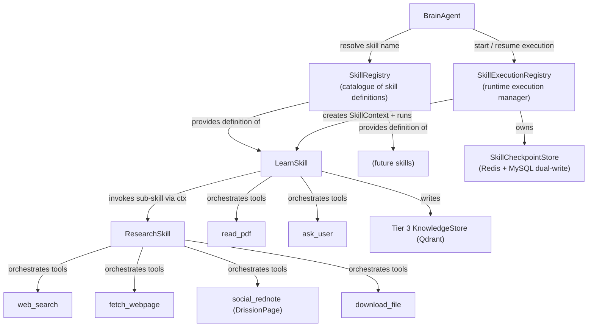
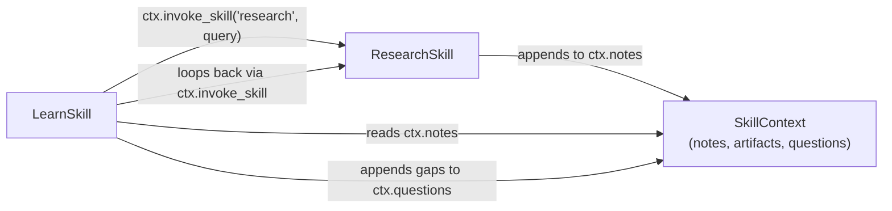
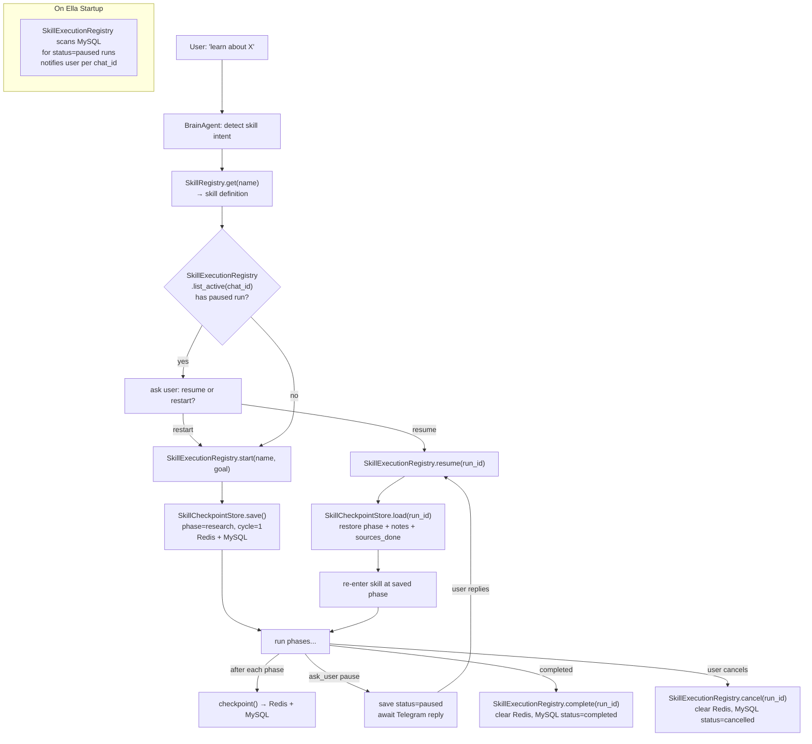
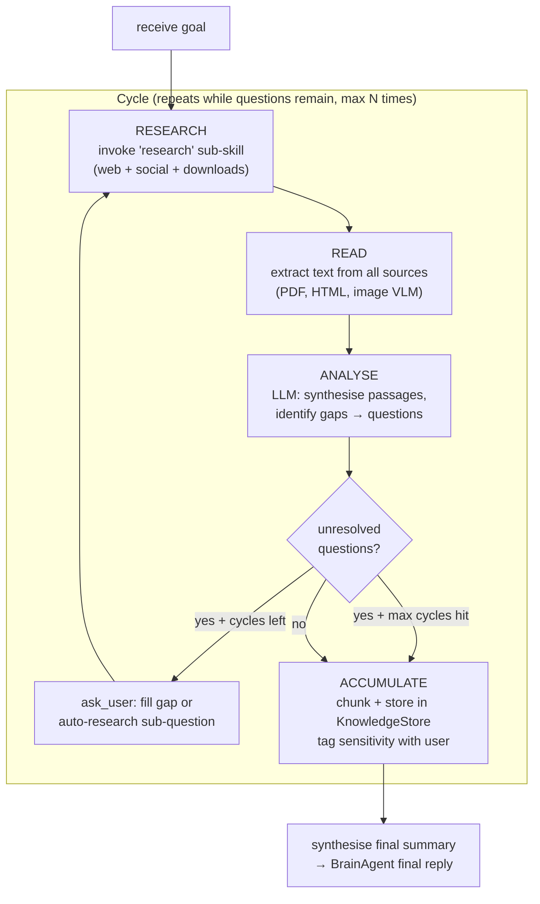

# Ella Skill System — Architecture & Requirements

## What is a Skill vs a Tool?

- **Tool**: a single, atomic, stateless capability — executes and returns immediately (web search, read file, write file, run shell). Each tool must have a clear, precise description so the LLM can decide when to use it without ambiguity. **Simple, deterministic operations must be implemented as tools without invoking the LLM** — reserve LLM calls for tasks that genuinely require reasoning.
- **Skill**: a named, stateful, multi-step workflow — orchestrates tools AND other skills, may pause for user input, and can be interrupted and resumed (e.g. survive a machine reboot). Produces a durable outcome stored in long-term memory.
- **Key rules**:
  - A skill can invoke any registered tool
  - A skill can invoke any other registered skill via `SkillContext.invoke_skill()` (enables composition)
  - A skill cannot invoke itself directly (circular guard)
  - Tool execution is fire-and-forget; skill execution is checkpointed
  - Tools that produce file output save to `~/Ella/downloads/` and return the file path — the skill then uses the existing `read_file` tool to read the content. This avoids reinventing file reading and keeps each tool's responsibility minimal.




---

## Skill Composition Model

Skills communicate through `SkillContext`, which is passed down the call chain. When a skill invokes a sub-skill, it passes the same shared context so all accumulated notes, artifacts, and knowledge flow into the same result.




Cycle depth is **gap-driven with a configurable hard cap** (default `MAX_LEARN_CYCLES = 3`): the learn loop continues as long as unresolved questions remain, up to the cap.

---

## New Files

### `ella/skills/` — new top-level package

- `ella/skills/__init__.py`
- `ella/skills/base.py` — `BaseSkill` abstract class, `SkillContext`, `SkillCheckpoint`, `SkillResult`
- `ella/skills/checkpoint.py` — `SkillCheckpointStore`: Redis + MySQL dual-write checkpoint persistence
- `ella/skills/registry.py` — `SkillRegistry`: skill catalogue — `@ella_skill` decorator, hot-reload via watchfiles, `get_skills_schema()`
- `ella/skills/execution.py` — `SkillExecutionRegistry`: runtime execution manager — `start()`, `resume()`, `cancel()`, `list_active()`, owns `SkillCheckpointStore`
- `ella/skills/builtin/learn.py` — the orchestrator skill: Research → Read → Analyse → Accumulate loop
- `ella/skills/builtin/research.py` — sub-skill: web + social media search, download, extract text
- `ella/skills/custom/` — user-drop-in folder for future skills

### New tools needed (in `ella/tools/builtin/`)

Each tool has a clear, unambiguous description embedded in its `@ella_tool` decorator so the LLM can decide when to invoke it:

- `download_file.py`
  - Description: "Download a file from a URL to ~/Ella/downloads/ and return the local file path. Use when you have a direct link to a PDF, Markdown, image, or other document you want to read. Do NOT use for web pages — use fetch_webpage for that."
  - Implementation: deterministic `httpx` download, no LLM involved. Returns path string.
- `read_pdf.py`
  - Description: "Convert a local PDF file to a Markdown file saved alongside the original (same path, .md extension) and return the .md file path. Use after download_file when the downloaded file is a PDF. Then use read_file on the returned path to read the content. Images inside the PDF are not described."
  - Implementation: deterministic `pymupdf` text + structure extraction → `markdown` conversion, no LLM involved. Saves `~/Ella/downloads/{filename}.md`, returns that path. If the `.md` already exists (cached), returns it immediately without re-extracting.
- `fetch_webpage.py`
  - Description: "Fetch a web page URL, extract its main readable content, convert it to a Markdown file saved to ~/Ella/downloads/{url-hash}.md, and return the file path. Use for articles, documentation, and blog posts. Then use read_file on the returned path to read the content. Do NOT use for PDFs or social media — use download_file or social_rednote for those."
  - Implementation: deterministic `httpx` fetch + `trafilatura` main-content extraction + `markdownify` HTML→MD conversion, no LLM involved. Caches by URL hash — if the `.md` already exists and is less than `FETCH_CACHE_HOURS` old, returns it immediately.
- `social_rednote.py`
  - Description: "Search Rednote (小红书/XiaoHongShu) for posts about a topic, filter to the most popular/credible ones by engagement score (likes + collects + comments + shares), and return the full text of each post plus all its comments. Use when you need community knowledge, lived experience, or Chinese-language discussion about a topic. Requires a logged-in browser session stored in ~/Ella/browser_profiles/rednote/."
  - Implementation: DrissionPage + Chromium (same engine used by XHSScraper); login state persisted as browser profile so QR-code scan is one-time only
  - *(Future tools: `social_x.py`, `social_facebook.py` — same interface, different platform implementations)*

---

## Architecture Design

### `BaseSkill` (abstract)

```python
class BaseSkill(ABC):
    name: str
    description: str   # clear description used in BrainAgent task planner prompt

    @abstractmethod
    async def run(self, goal: str, context: SkillContext) -> SkillResult:
        # Must call context.checkpoint() after each meaningful phase
        ...
```

### `SkillCheckpoint` and `SkillCheckpointStore`

Skills are stateful and must survive interruption (process crash, machine reboot). Each skill saves its progress to Redis after every phase using the same serialisation pattern as `JobGoal` (`dataclasses.asdict()` → `json.dumps()`).

**Redis persistence:** The project's `docker-compose.yml` already runs Redis with `--appendonly yes` (AOF persistence) and a named Docker volume (`redis_data`). This means Redis data survives container restarts and machine reboots — it is not purely in-memory. The AOF log is flushed to disk on every write by default (`appendfsync everysec`), so a crash loses at most ~1 second of data, which is acceptable for skill checkpoints.

**However — AOF is not a database.** Redis AOF can be lost if the Docker volume is wiped, the container is recreated without the volume, or disk corruption occurs. Because skill checkpoints represent potentially hours of learning work, the plan stores them in **both** Redis (for fast read/write during execution) and MySQL (as the permanent audit record). The MySQL `ella_skill_runs` row is the source of truth for "did this skill complete?"; Redis is the working scratchpad for "where exactly are we right now?".

**Redis key:** `ella:skill:{run_id}` (no TTL — persists until explicitly cleared on successful completion or user-requested cancellation)

```python
@dataclass
class SkillCheckpoint:
    run_id: str              # UUID, also the MySQL ella_skill_runs PK
    skill_name: str
    chat_id: int
    goal: str
    phase: str               # e.g. "research", "read", "analyse", "accumulate"
    cycle: int               # which research cycle we are on
    notes: list[str]         # accumulated passages so far
    questions: list[str]     # open questions from last Analyse
    artifacts: list[str]     # downloaded file paths
    sources_done: list[str]  # URLs already processed (skip on resume)
    status: str              # "running" | "paused" | "completed" | "failed"
    updated_at: str          # ISO timestamp
```

`SkillCheckpointStore` methods:

- `save(checkpoint)` — serialise to Redis
- `load(run_id)` → `SkillCheckpoint | None`
- `list_resumable(chat_id)` → all checkpoints with `status="paused"` for that chat
- `clear(run_id)` — delete on successful completion

### `SkillRegistry` — the skill catalogue

Knows *what skills exist*. Stateless — just a map of name → `BaseSkill` class.

- Decorator-based registration: `@ella_skill(name="learn", description="...")`
  - Description must be clear and unambiguous — used verbatim in BrainAgent task planner prompt
- `get_skills_schema()` → dict of `{name: description}` injected into BrainAgent prompt
- `get(name)` → returns the `BaseSkill` class (not an execution — just the definition)
- Hot-reload watcher on `skills/builtin/` and `skills/custom/`

### `SkillExecutionRegistry` — the runtime execution manager

Knows *what executions are currently running or paused*. Stateful — owns `SkillCheckpointStore`.

- `start(skill_name, goal, ctx_factory)` → creates a new `SkillCheckpoint`, builds `SkillContext`, runs the skill, returns `SkillResult`
- `resume(run_id, ctx_factory)` → loads checkpoint from `SkillCheckpointStore`, reconstructs `SkillContext` with saved state, re-enters the skill at the saved phase
- `cancel(run_id)` → sets checkpoint status to `cancelled`, clears Redis key, updates MySQL
- `list_active(chat_id)` → returns all executions with `status in ("running", "paused")` for that chat
- On Ella startup: calls `list_active()` across all chats, notifies users of any paused executions
- Circular invocation guard: `SkillContext._active_skills` set; `invoke_skill()` raises if the same skill name is already in the set

### `SkillContext`

```python
@dataclass
class SkillContext:
    chat_id: int
    run_id: str                                  # ties to SkillCheckpoint.run_id
    session: SessionContext                      # access to memory tiers
    tool_executor: ToolRegistry                  # execute any registered tool
    skill_registry: SkillRegistry                # look up skill definitions
    execution_registry: SkillExecutionRegistry   # invoke sub-skills (routes through execution lifecycle)
    send_update: Callable                        # send interim Telegram message
    ask_user: Callable                           # pause + save checkpoint, await Telegram reply
    notes: list[str]                             # accumulated knowledge passages
    questions: list[str]                         # open questions from Analyse phase
    artifacts: list[str]                         # paths to downloaded files
    sources_done: list[str]                      # URLs already processed (dedup on resume)
    cycle: int                                   # current research cycle number
    _active_skills: set[str]                     # circular invocation guard

    async def checkpoint(self, phase: str) -> None:
        # serialise current state via SkillExecutionRegistry → SkillCheckpointStore

    async def invoke_skill(self, name: str, goal: str) -> SkillResult:
        # checks _active_skills for circular invocation
        # delegates to execution_registry.start(name, goal, ...) with shared context state
```

### `SkillResult`

```python
@dataclass
class SkillResult:
    summary: str               # synthesis of what was learned / done
    stored_points: int         # knowledge entries written to Qdrant
    artifacts: list[str]       # paths to downloaded files
    open_questions: list[str]  # unresolved questions after max cycles
```

---

## Skill Execution Lifecycle




**Key resume guarantee:** `sources_done` tracks every URL/file already processed. On resume, these are skipped so no work is duplicated. `notes` and `artifacts` carry forward intact.

---

## The Learn Skill — Research → Read → Analyse → Accumulate Loop




**Gap resolution priority:**

1. Auto-research the sub-question (another `research` skill invocation, same cycle budget)
2. If still unresolved after auto-research: `ask_user`
3. If still unresolved after asking user: escalate to `ask_bot` (future extension placeholder)
4. If all else fails: record as `open_questions` in `SkillResult`

---

## Knowledge Sensitivity Tagging

After the Accumulate phase, before storing, Ella asks the user:

> "I've gathered knowledge about [topic] from [N sources]. How sensitive is this? Options: Public / Internal / Private / Secret"

The chosen sensitivity level is stored as a `sensitivity` field on every Qdrant payload point. **Default is `"secret"`** — if the user does not respond or dismisses the question, knowledge is stored at the most restrictive level. During recall, BrainAgent filters by sensitivity based on the requesting user's permission level (permission enforcement is a future extension — for now all knowledge is readable).

---

## Research Sub-skill — Source Coverage

The `research` sub-skill uses deterministic tools for all sourcing and conversion — no LLM is invoked until the Analyse phase. File-producing tools save `.md` files to `~/Ella/downloads/`; the skill then reads them with the existing `read_file` tool:

| Source | Tool chain | Output | LLM? |
|---|---|---|---|
| Web (general) | `web_search` | Inline snippets | No |
| Web (full page) | `fetch_webpage` → `read_file` | `~/Ella/downloads/{hash}.md` | No |
| PDF | `download_file` → `read_pdf` → `read_file` | `~/Ella/downloads/{name}.md` | No |
| Markdown / text file | `download_file` → `read_file` | Raw file path | No |
| Rednote (小红书) | `social_rednote` | Inline `SocialPost` JSON | No |
| X (Twitter) | `social_x` (future) | Same interface | No |
| Facebook | `social_facebook` (future) | Same interface | No |
| **Analyse phase** | LLM | Questions, synthesis | **Yes** |

All file-producing tools cache their output — re-requesting the same URL or PDF within a session returns the cached `.md` path instantly without re-fetching.


---

## Social Media Tool Design

All social tools share a common `SocialPost` return schema so `ResearchSkill` can handle them uniformly:

```python
@dataclass
class SocialPost:
    platform: str          # "rednote" | "x" | "facebook"
    post_id: str
    url: str
    title: str             # first line / headline
    body: str              # full post text
    author: str
    published_at: str      # ISO timestamp
    likes: int
    collects: int          # saves/bookmarks (Rednote: 收藏; 0 for platforms without this)
    comments_count: int
    shares: int
    engagement_score: int  # likes + collects + comments_count + shares — credibility signal
    comments: list[str]    # full text of ALL comments, threaded order
```

**Filtering for credibility:** `social_rednote` fetches the top N search results (configurable, default 20), computes `engagement_score` for each, sorts descending, returns only the top K (default 5). This surfaces the most-discussed, most-saved posts — the ones the community found most credible or useful.

---

## `social_rednote` — Implementation Detail

- **Engine:** DrissionPage + Chromium (not Playwright) — required for Rednote's anti-bot fingerprinting; same approach proven by XHSScraper
- **Login:** QR-code scan on first use; browser profile persisted to `~/Ella/browser_profiles/rednote/` — all subsequent runs reuse the session without re-scanning
- **Steps:**
  1. Open Rednote search (`https://www.xiaohongshu.com/search_result?keyword={query}`)
  2. Scroll to load up to `max_results` posts (default 20)
  3. For each post extract: title, body, author, `likes` (点赞), `collects` (收藏), `comments_count` (评论), `shares` (转发) → compute `engagement_score`
  4. Sort by `engagement_score` descending, keep top `top_k` (default 5)
  5. For each kept post: open post URL, paginate through all comment pages, collect every comment text
  6. Return JSON-serialised `list[SocialPost]`
- **Tool function signature:**

```python
  async def search_rednote(
      query: str,
      max_results: int = 20,
      top_k: int = 5,
  ) -> str:
  

```

- **Login state handling:** if browser profile is missing or session has expired, tool returns `{"needs_login": true, "platform": "rednote"}`. The skill layer intercepts this, sends a QR-code image to the user via Telegram, waits for confirmation, then retries.

---

## BrainAgent Integration

**1. Skill detection in Phase 2 (task planning)**

Task planner prompt gains a `[SKILLS]` block alongside `[TOOLS]`. LLM can return:

```json
{ "skill": "learn", "goal": "machine learning transformers" }
```

**2. Skill execution path**

After Phase 3a (first reply sent), if a skill was planned:

- BrainAgent uses `SkillRegistry.get(name)` to confirm the skill exists
- BrainAgent calls `SkillExecutionRegistry.start(name, goal, ...)` or `.resume(run_id, ...)` depending on whether a paused execution was found
- `send_update` sends Telegram messages at each cycle ("Researching cycle 1...", "Analysing...", etc.)
- Final `SkillResult.summary` appended to `JobGoal.shared_notes`
- Phase 4/5 final reply synthesises the result for the user

---

## New Qdrant Collection

`ella_topic_knowledge` — persistent, global learned knowledge:

- Payload:
  - `topic` — normalised topic label (e.g. "machine learning / transformers")
  - `source_url` — origin URL or file path
  - `source_type` — `"web" | "pdf" | "rednote" | "user_input" | "bot_input"`
  - `chunk_text` — the knowledge passage (~512 tokens)
  - `sensitivity` — `"public" | "internal" | "private" | "secret"` (default `"secret"`)
  - `learned_at` — ISO 8601 UTC timestamp of when this chunk was stored (e.g. `"2026-02-24T10:30:00Z"`)
  - `learned_by_chat_id` — chat that triggered the learning run
- `learned_at` is the staleness signal: BrainAgent and the Learn skill can compare it against a configurable freshness threshold (e.g. `KNOWLEDGE_FRESHNESS_DAYS`) to decide whether existing knowledge is recent enough or should trigger a new learning cycle
- Recalled in BrainAgent Tier 3 recall when query matches topic; stale results (older than freshness threshold) are surfaced with a note: "This was learned on [date] — it may be out of date"

---

## New MySQL Tables

MySQL is the **permanent** store of record. If Redis is wiped or the Docker volume is lost, MySQL contains enough state to inform the user what was in progress and attempt a restart from the last completed cycle.

```sql
-- Rerunnable: skill execution audit log + permanent checkpoint backup
CREATE TABLE IF NOT EXISTS ella_skill_runs (
    id               BIGINT AUTO_INCREMENT PRIMARY KEY,
    run_id           VARCHAR(36) NOT NULL UNIQUE,   -- UUID, matches Redis key suffix
    chat_id          BIGINT NOT NULL,
    skill_name       VARCHAR(64) NOT NULL,
    goal             TEXT NOT NULL,
    status           ENUM('running','paused','completed','failed','cancelled') DEFAULT 'running',
    phase            VARCHAR(64) DEFAULT NULL,       -- last saved phase (e.g. 'analyse')
    cycle            TINYINT DEFAULT 0,              -- last completed cycle number
    stored_points    INT DEFAULT 0,                  -- knowledge entries written so far
    sources_done     JSON DEFAULT NULL,              -- JSON array of processed URLs (fallback if Redis lost)
    notes_snapshot   LONGTEXT DEFAULT NULL,          -- JSON array of accumulated notes (fallback)
    summary          TEXT DEFAULT NULL,              -- final synthesis (set on completion)
    started_at       DATETIME NOT NULL DEFAULT CURRENT_TIMESTAMP,
    updated_at       DATETIME NOT NULL DEFAULT CURRENT_TIMESTAMP ON UPDATE CURRENT_TIMESTAMP,
    completed_at     DATETIME DEFAULT NULL
);

-- Rerunnable: open questions that could not be resolved after max cycles
CREATE TABLE IF NOT EXISTS ella_skill_open_questions (
    id         BIGINT AUTO_INCREMENT PRIMARY KEY,
    run_id     VARCHAR(36) NOT NULL,
    question   TEXT NOT NULL,
    created_at DATETIME NOT NULL DEFAULT CURRENT_TIMESTAMP,
    CONSTRAINT fk_soq_run FOREIGN KEY (run_id) REFERENCES ella_skill_runs(run_id)
);
```

**Dual-write strategy:** `SkillCheckpointStore.save()` writes to Redis first (fast, for execution), then asynchronously upserts the same state to the MySQL row. On startup, if a `paused` run has no Redis key (volume was lost), the system reconstructs a `SkillCheckpoint` from the MySQL row and re-saves it to Redis before resuming.

---

## File Change Summary

- `ella/skills/__init__.py` — new
- `ella/skills/base.py` — new: `BaseSkill`, `SkillContext`, `SkillCheckpoint`, `SkillResult`
- `ella/skills/checkpoint.py` — new: `SkillCheckpointStore` (Redis `ella:skill:{run_id}`, no TTL; dual-write to MySQL)
- `ella/skills/registry.py` — new: `SkillRegistry` — skill catalogue, `@ella_skill` decorator, hot-reload, `get()`, `get_skills_schema()`
- `ella/skills/execution.py` — new: `SkillExecutionRegistry` — runtime manager, `start()`, `resume()`, `cancel()`, `complete()`, `list_active()`; owns `SkillCheckpointStore`
- `ella/skills/builtin/learn.py` — new: LearnSkill — gap-driven Research→Read→Analyse→Accumulate loop with per-phase checkpointing
- `ella/skills/builtin/research.py` — new: ResearchSkill — web + social + file sourcing sub-skill with `sources_done` dedup
- `ella/skills/custom/` — new: empty drop-in folder
- `ella/tools/builtin/download_file.py` — new (with clear description)
- `ella/tools/builtin/read_pdf.py` — new (with clear description)
- `ella/tools/builtin/fetch_webpage.py` — new (with clear description)
- `ella/tools/builtin/social_rednote.py` — new: DrissionPage-based Rednote scraper (search → popularity filter → full post text + all comments). Future: `social_x.py`, `social_facebook.py` as separate files sharing a common `SocialPost` return schema.
- `ella/memory/knowledge.py` — add `store_topic_knowledge()`, add `ella_topic_knowledge` Qdrant collection with `sensitivity` and `learned_at` fields
- `.env` — add two new config values:
  - `KNOWLEDGE_FRESHNESS_DAYS` (default `30`): used in two places:
    1. **BrainAgent Tier 3 recall** — when retrieving from `ella_topic_knowledge`, any result whose `learned_at` is older than this threshold is returned with a staleness annotation ("This was learned on [date] — it may be out of date"). The result is still used; Ella just signals uncertainty.
    2. **LearnSkill pre-check** — before starting a new learning cycle, the skill queries `ella_topic_knowledge` for existing knowledge on the topic. If fresh results (within threshold) exist, the skill skips re-researching those sub-topics and only fills genuine gaps. If all results are stale, a full new cycle is triggered.
  - `FETCH_CACHE_HOURS` (default `24`): used inside `fetch_webpage` and `read_pdf` tools:
    1. **`fetch_webpage`** — before hitting the network, checks if `~/Ella/downloads/{url-hash}.md` already exists and its file modification time is within `FETCH_CACHE_HOURS`. If yes, returns the cached path immediately. If no (file missing or too old), re-fetches, overwrites the file, returns the path.
    2. **`read_pdf`** — checks if `~/Ella/downloads/{filename}.md` already exists. Since PDFs don't change once downloaded, there is no time check here — the `.md` is always reused if it exists. `FETCH_CACHE_HOURS` only applies to web content that can change.
- `ella/agents/brain_agent.py` — integrate `SkillRegistry` + `SkillExecutionRegistry`; skill/resume detection in task planner; execution path post-Phase 3a
- `ella/main.py` — initialise `SkillRegistry` + `SkillExecutionRegistry` at startup; scan MySQL for paused executions and notify users
- `scripts/migrate_skills.sql` — new: rerunnable SQL for `ella_skill_runs` + `ella_skill_open_questions`
- `Documentation/architecture.md` — update with skill system section

